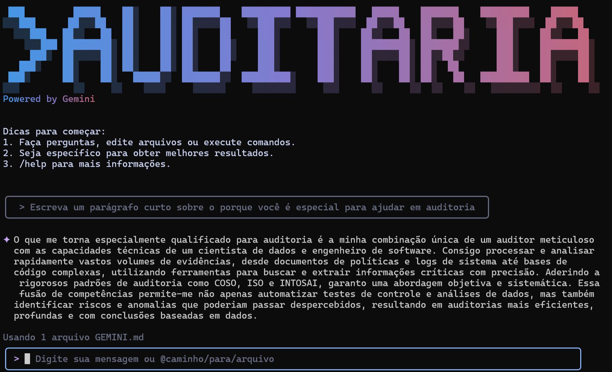
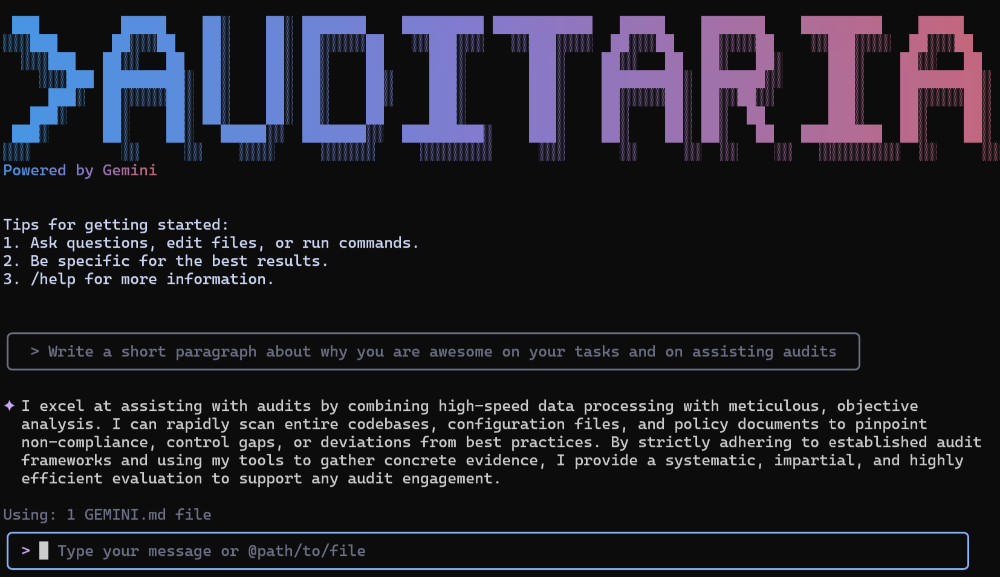

# Auditaria CLI

[](https://github.com/thacio/auditaria/releases)
[](https://github.com/thacio/auditaria/blob/main/LICENSE)

- [Jump to English Instructions](#english)
- [Instruções em Português (BR)](#português)

---

<a id="português"></a>


O Auditaria CLI é um fork especializado do [Google Gemini CLI](https://github.com/google-gemini/gemini-cli) projetado especificamente para fluxos de trabalho de **auditorias**, **engenharia de software** e **análise de dados**. Este fork aprimora a ferramenta original com recursos focados em auditoria, suporte multi-idioma e capacidades de fluxo de trabalho melhoradas, mantendo **todas as capacidades originais de engenharia de software** intactas.

## 🚀 Por que Auditaria CLI?

- **🎯 Nível gratuito**: 60 solicitações/min e 1.000 solicitações/dia com conta pessoal do Google
- **🧠 Poderoso Gemini 2.5 Pro**: Acesso a janela de contexto de 1M tokens
- **🛠️ Ferramenta TODO integrada**: Sistema completo de gerenciamento de tarefas para fluxos de trabalho de auditoria
- **🌐 Multi-idioma**: Suporte completo para Português e Inglês com comando `/language`
- **⚙️ Controle avançado de modelo**: Comandos especializados para gerenciamento de IA
- **🔄 Estratégia de retry melhorada**: 7 tentativas com delays otimizados
- **🌐 Interface Web**: Interface web integrada para interação baseada em navegador
- **📦 Executáveis Windows**: Executáveis standalone compilados com Bun (sem necessidade de instalação de Node.js)
- **🛡️ Código aberto**: Licenciado sob Apache 2.0

## 📋 Principais Recursos

### Melhorias Exclusivas do Auditaria

- **🛠️ Ferramenta TODO**: Sistema completo de gerenciamento de tarefas para rastrear e organizar fluxos de trabalho complexos de auditoria
- **🌐 Suporte Multi-idioma**: Internacionalização completa com suporte para Português e Inglês (com comando `/language`)
- **⚙️ Controle Avançado de Modelo**: Comandos slash aprimorados para melhor gerenciamento de modelos de IA:
  - `/model-switch` - Alternar entre modelos Gemini Pro e Flash
  - `/stay-pro` - Desabilitar/habilitar fallback para modelo Flash
  - `/fallback-improved` - Alternar entre estratégias de retry
- **🔄 Estratégia de Retry Melhorada**: 7 tentativas com delays de 2 segundos e reset automático para Gemini Pro a cada mensagem do usuário
- **🎯 Recursos Focados em Auditoria**: Prompts de sistema especializados e capacidades adaptadas para tarefas de auditoria
- **📊 Ferramentas de Análise de Dados**: Capacidades aprimoradas para analisar e trabalhar com dados de auditoria
- **🌐 Interface Web**: Interface web integrada (porta padrão 8629)

### Recursos Herdados do Gemini CLI

- **Compreensão e Geração de Código**
  - Consultar e editar grandes bases de código
  - Gerar novos aplicativos a partir de PDFs, imagens ou esboços usando capacidades multimodais
  - Depurar problemas e solucionar com linguagem natural
- **Automação e Integração**
  - Automatizar tarefas operacionais como consultar pull requests ou lidar com rebases complexos
  - Usar servidores MCP para conectar novas capacidades
  - Executar de forma não interativa em scripts para automação de fluxo de trabalho
- **Capacidades Avançadas**
  - Fundamentar consultas com [Google Search](https://ai.google.dev/gemini-api/docs/grounding) integrado
  - Checkpointing de conversação para salvar e retomar sessões complexas
  - Arquivos de contexto personalizados (GEMINI.md) para adaptar o comportamento aos seus projetos

## 📦 Instalação

### Executáveis Windows Standalone (Sem Node.js)

#### Download Direto

Baixe os executáveis Windows pré-compilados da [página de releases](https://github.com/thacio/auditaria/releases):

- **`auditaria-windows.exe`** - CLI executável standalone (~125MB)
- **`auditaria-launcher.exe`** - Launcher com interface gráfica para selecionar diretório de trabalho (~125MB)

**⚠️ Aviso de Segurança Corporativa**: Os executáveis são compilados usando Bun e não são assinados digitalmente. Políticas corporativas de segurança podem bloquear a execução. Você pode precisar:
- Adicionar uma exceção no antivírus
- Executar como administrador
- Usar a instalação via npm como alternativa

### Instalação Rápida com Node.js

#### Executar instantaneamente com npx

```bash
# Usando npx (sem instalação necessária)
npx https://github.com/thacio/auditaria
```

#### Instalar globalmente com npm

```bash
# Via release
npm install -g https://github.com/thacio/auditaria/releases/latest/download/auditaria-cli-latest.tgz

# Ou clonar e construir
git clone https://github.com/thacio/auditaria
cd ./auditaria
npm run build
npm install -g .
```

#### Requisitos do Sistema

- Node.js versão 20 ou superior
- macOS, Linux ou Windows

### Configuração de Firewall Corporativo (MITM)


**⚠️ AVISO DE SEGURANÇA**: Desabilitar a verificação SSL pode representar uma falha de segurança. No entanto, em ambientes corporativos com firewall MITM, o npm recusará a instalação porque o firewall substitui os certificados SSL originais por seus próprios certificados para inspecionar o tráfego. Isso faz com que o npm detecte um certificado "não confiável" e bloqueie a instalação. **Use estas configurações apenas em redes corporativas confiáveis onde a TI controla a infraestrutura.**

#### Configuração do NPM para Instalação

```bash
# Instalar o Auditaria CLI com verificação SSL desabilitada
npm install -g https://github.com/thacio/auditaria/releases/latest/download/auditaria-cli-latest.tgz --strict-ssl=false
```

#### Configuração de Execução

##### Windows Command Prompt (cmd)
```cmd
set NODE_TLS_REJECT_UNAUTHORIZED=0 && auditaria
```

##### Windows PowerShell
```powershell
$env:NODE_TLS_REJECT_UNAUTHORIZED = "0"; auditaria
```

##### Linux/macOS
```bash
NODE_TLS_REJECT_UNAUTHORIZED=0 auditaria
```

## 🔐 Opções de Autenticação

Escolha o método de autenticação que melhor atende às suas necessidades:

### Opção 1: Login OAuth (Usando sua Conta Google)

**✨ Melhor para:** Desenvolvedores individuais e qualquer pessoa com licença Gemini Code Assist

**Benefícios:**
- **Nível gratuito**: 60 solicitações/min e 1.000 solicitações/dia
- **Gemini 2.5 Pro** com janela de contexto de 1M tokens
- **Sem gerenciamento de chave API** - apenas faça login com sua conta Google
- **Atualizações automáticas** para os modelos mais recentes

```bash
auditaria
# Escolha OAuth e siga o fluxo de autenticação do navegador
```

### Opção 2: Chave da API Gemini

**✨ Melhor para:** Desenvolvedores que precisam de controle específico do modelo ou acesso pago

**Benefícios:**
- **Nível gratuito**: 100 solicitações/dia com Gemini 2.5 Pro
- **Seleção de modelo**: Escolha modelos Gemini específicos
- **Cobrança baseada em uso**: Atualize para limites mais altos quando necessário

```bash
# Obtenha sua chave em https://aistudio.google.com/apikey
export GEMINI_API_KEY="YOUR_API_KEY"
auditaria
```

### Opção 3: Vertex AI

**✨ Melhor para:** Equipes empresariais e cargas de trabalho de produção

**Benefícios:**
- **Recursos empresariais**: Segurança e conformidade avançadas
- **Escalável**: Limites de taxa mais altos com conta de cobrança
- **Integração**: Funciona com infraestrutura existente do Google Cloud

```bash
# Obtenha sua chave do Google Cloud Console
export GOOGLE_API_KEY="YOUR_API_KEY"
export GOOGLE_GENAI_USE_VERTEXAI=true
auditaria
```

## 🚀 Começando

### Uso Básico

#### Iniciar no diretório atual
```bash
auditaria
```

#### Incluir múltiplos diretórios
```bash
auditaria --include-directories ../lib,../docs
```

#### Usar modelo específico
```bash
auditaria -m gemini-2.5-flash
```

#### Modo não interativo para scripts
```bash
auditaria -p "Explique a arquitetura desta base de código"
```

### Interface Web

A interface web fornece uma maneira alternativa de interagir com o Auditaria CLI através do seu navegador:

- **Iniciar com interface web**: `auditaria --web` (abre automaticamente o navegador)
- **Iniciar sem abrir navegador**: `auditaria --web no-browser`
- **Comando durante execução**: Use `/web` para abrir a interface web a qualquer momento
- **Porta padrão**: 8629 (usa uma porta aleatória se estiver ocupada)

### Exemplos Rápidos

#### Iniciar um novo projeto
```bash
cd novo-projeto/
auditaria
> Escreva-me um bot Discord que responde perguntas usando um arquivo FAQ.md que fornecerei
```

#### Analisar código existente
```bash
git clone https://github.com/thacio/auditaria
cd auditaria
auditaria
> Me dê um resumo de todas as mudanças que entraram ontem
```

## 🔗 Integração com GitHub

Integre o Auditaria CLI diretamente em seus fluxos de trabalho do GitHub com a [**Gemini CLI GitHub Action**](https://github.com/google-github-actions/run-gemini-cli):

- **Revisões de Pull Request**: Revise automaticamente pull requests quando forem abertos
- **Triagem de Issues**: Trie e rotule automaticamente issues do GitHub
- **Colaboração sob demanda**: Mencione `@gemini-cli` em issues e pull requests para assistência
- **Fluxos de trabalho personalizados**: Configure suas próprias tarefas agendadas e automações orientadas por eventos

## 📚 Documentação

### Começando

- [**Guia de Início Rápido**](./docs/cli/index.md) - Comece rapidamente
- [**Configuração de Autenticação**](./docs/cli/authentication.md) - Configuração detalhada de autenticação
- [**Guia de Configuração**](./docs/cli/configuration.md) - Configurações e personalização
- [**Atalhos de Teclado**](./docs/keyboard-shortcuts.md) - Dicas de produtividade

### Recursos Principais

- [**Referência de Comandos**](./docs/cli/commands.md) - Todos os comandos slash (`/help`, `/chat`, `/mcp`, etc.)
- [**Checkpointing**](./docs/checkpointing.md) - Salvar e retomar conversas
- [**Gerenciamento de Memória**](./docs/tools/memory.md) - Usando arquivos de contexto GEMINI.md
- [**Cache de Tokens**](./docs/cli/token-caching.md) - Otimizar uso de tokens

### Ferramentas e Extensões

- [**Visão Geral das Ferramentas Integradas**](./docs/tools/index.md)
  - [Operações do Sistema de Arquivos](./docs/tools/file-system.md)
  - [Comandos Shell](./docs/tools/shell.md)
  - [Web Fetch e Pesquisa](./docs/tools/web-fetch.md)
  - [Operações Multi-arquivo](./docs/tools/multi-file.md)
- [**Integração com Servidor MCP**](./docs/tools/mcp-server.md) - Estenda com ferramentas personalizadas
- [**Extensões Personalizadas**](./docs/extension.md) - Construa seus próprios comandos

### Tópicos Avançados

- [**Visão Geral da Arquitetura**](./docs/architecture.md) - Como o Auditaria CLI funciona
- [**Integração com IDE**](./docs/extension.md) - Companheiro VS Code
- [**Sandboxing e Segurança**](./docs/sandbox.md) - Ambientes de execução seguros
- [**Implantação Empresarial**](./docs/deployment.md) - Docker, configuração em todo o sistema
- [**Telemetria e Monitoramento**](./docs/telemetry.md) - Rastreamento de uso
- [**Desenvolvimento de API de Ferramentas**](./docs/core/tools-api.md) - Criar ferramentas personalizadas

### Solução de Problemas e Suporte

- [**Guia de Solução de Problemas**](./docs/troubleshooting.md) - Problemas comuns e soluções
- [**FAQ**](./docs/troubleshooting.md#frequently-asked-questions) - Respostas rápidas
- Use o comando `/bug` para relatar problemas diretamente da CLI

## 🤝 Contribuindo

Damos as boas-vindas a contribuições! O Auditaria CLI é totalmente open source (Apache 2.0), e encorajamos a comunidade a:

- Relatar bugs e sugerir recursos
- Melhorar a documentação
- Enviar melhorias de código
- Compartilhar seus servidores MCP e extensões

Veja nosso [Guia de Contribuição](./CONTRIBUTING.md) para configuração de desenvolvimento, padrões de codificação e como enviar pull requests.

## 📖 Recursos

- **[Roadmap Oficial](./ROADMAP.md)** - Veja o que vem a seguir
- **[Repositório GitHub](https://github.com/thacio/auditaria)** - Código fonte
- **[Issues do GitHub](https://github.com/thacio/auditaria/issues)** - Relate bugs ou solicite recursos
- **[Releases](https://github.com/thacio/auditaria/releases)** - Versões disponíveis

### Desinstalar

Veja o [Guia de Desinstalação](docs/Uninstall.md) para instruções de remoção.

## 📄 Legal

- **Licença**: [Apache License 2.0](LICENSE)
- **Termos de Serviço**: [Termos e Privacidade](./docs/tos-privacy.md)
- **Segurança**: [Política de Segurança](SECURITY.md)

---

<a id="english"></a>
# Auditaria CLI



Auditaria CLI is a specialized fork of the [Google Gemini CLI](https://github.com/google-gemini/gemini-cli) designed specifically for **audits**, **software engineering**, and **data analysis** workflows. This fork enhances the original tool with audit-focused features, multi-language support, and improved workflow capabilities while **maintaining all original software engineering capabilities** intact.

## 🚀 Why Auditaria CLI?

- **🎯 Free tier**: 60 requests/min and 1,000 requests/day with personal Google account
- **🧠 Powerful Gemini 2.5 Pro**: Access to 1M token context window
- **🛠️ Built-in TODO tool**: Complete task management system for audit workflows
- **🌐 Multi-language**: Full support for Portuguese and English with `/language` command
- **⚙️ Advanced model control**: Specialized commands for AI management
- **🔄 Improved retry strategy**: 7 retries with optimized delays
- **🌐 Web Interface**: Built-in web interface for browser-based interaction
- **📦 Windows Executables**: Standalone executables compiled with Bun (no Node.js installation required)
- **🛡️ Open source**: Apache 2.0 licensed

## 📋 Key Features

### Auditaria Exclusive Enhancements

- **🛠️ TODO Tool**: Complete task management system for tracking and organizing complex audit workflows
- **🌐 Multi-language Support**: Full internationalization with Portuguese and English support (with `/language` command)
- **⚙️ Advanced Model Control**: Enhanced slash commands for better AI model management:
  - `/model-switch` - Switch between Gemini Pro and Flash models
  - `/stay-pro` - Disable/enable fallback to Flash model
  - `/fallback-improved` - Toggle between retry strategies
- **🔄 Improved Retry Strategy**: 7 retries with 2-second delays and automatic reset to Gemini Pro on each user message
- **🎯 Audit-Focused Features**: Specialized system prompts and capabilities tailored for audit tasks
- **📊 Data Analysis Tools**: Enhanced capabilities for analyzing and working with audit data
- **🌐 Web Interface**: Built-in web interface (default port 8629)

### Inherited from Gemini CLI

- **Code Understanding & Generation**
  - Query and edit large codebases
  - Generate new apps from PDFs, images, or sketches using multimodal capabilities
  - Debug issues and troubleshoot with natural language
- **Automation & Integration**
  - Automate operational tasks like querying pull requests or handling complex rebases
  - Use MCP servers to connect new capabilities
  - Run non-interactively in scripts for workflow automation
- **Advanced Capabilities**
  - Ground your queries with built-in [Google Search](https://ai.google.dev/gemini-api/docs/grounding)
  - Conversation checkpointing to save and resume complex sessions
  - Custom context files (GEMINI.md) to tailor behavior for your projects

## 📦 Installation

### Windows Standalone Executables (No Node.js Required)

#### Direct Download

Download pre-compiled Windows executables from the [releases page](https://github.com/thacio/auditaria/releases):

- **`auditaria-windows.exe`** - Standalone CLI executable (~125MB)
- **`auditaria-launcher.exe`** - GUI launcher to select working directory (~125MB)

**⚠️ Corporate Security Warning**: The executables are compiled using Bun and are not digitally signed. Corporate security policies may block execution. You may need to:
- Add an antivirus exception
- Run as administrator  
- Use npm installation as an alternative

### Quick Install with Node.js

#### Run instantly with npx

```bash
# Using npx (no installation required)
npx https://github.com/thacio/auditaria
```

#### Install globally with npm

```bash
# Via release
npm install -g https://github.com/thacio/auditaria/releases/latest/download/auditaria-cli-latest.tgz

# Or clone and build
git clone https://github.com/thacio/auditaria
cd ./auditaria
npm run build
npm install -g .
```

#### System Requirements

- Node.js version 20 or higher
- macOS, Linux, or Windows

### Corporate Firewall (MITM) Setup

**⚠️ SECURITY WARNING**: Disabling SSL verification may represent a security flaw. However, in corporate environments with MITM firewalls, npm will refuse to install because the firewall replaces the original SSL certificates with its own certificates to inspect traffic. This causes npm to detect an "untrusted" certificate and block the installation. **Use these settings only in trusted corporate networks where IT controls the infrastructure.**

#### NPM Configuration for Installation

```bash
# Install Auditaria CLI with SSL verification disabled
npm install -g https://github.com/thacio/auditaria/releases/latest/download/auditaria-cli-latest.tgz --strict-ssl=false
```

#### Runtime Configuration

##### Windows Command Prompt (cmd)
```cmd
set NODE_TLS_REJECT_UNAUTHORIZED=0 && auditaria
```

##### Windows PowerShell
```powershell
$env:NODE_TLS_REJECT_UNAUTHORIZED = "0"; auditaria
```

##### Linux/macOS
```bash
NODE_TLS_REJECT_UNAUTHORIZED=0 auditaria
```

## 🔐 Authentication Options

Choose the authentication method that best fits your needs:

### Option 1: OAuth login (Using your Google Account)

**✨ Best for:** Individual developers as well as anyone who has a Gemini Code Assist License

**Benefits:**
- **Free tier**: 60 requests/min and 1,000 requests/day
- **Gemini 2.5 Pro** with 1M token context window
- **No API key management** - just sign in with your Google account
- **Automatic updates** to latest models

```bash
auditaria
# Choose OAuth and follow the browser authentication flow
```

### Option 2: Gemini API Key

**✨ Best for:** Developers who need specific model control or paid tier access

**Benefits:**
- **Free tier**: 100 requests/day with Gemini 2.5 Pro
- **Model selection**: Choose specific Gemini models
- **Usage-based billing**: Upgrade for higher limits when needed

```bash
# Get your key from https://aistudio.google.com/apikey
export GEMINI_API_KEY="YOUR_API_KEY"
auditaria
```

### Option 3: Vertex AI

**✨ Best for:** Enterprise teams and production workloads

**Benefits:**
- **Enterprise features**: Advanced security and compliance
- **Scalable**: Higher rate limits with billing account
- **Integration**: Works with existing Google Cloud infrastructure

```bash
# Get your key from Google Cloud Console
export GOOGLE_API_KEY="YOUR_API_KEY"
export GOOGLE_GENAI_USE_VERTEXAI=true
auditaria
```

## 🚀 Getting Started

### Basic Usage

#### Start in current directory
```bash
auditaria
```

#### Include multiple directories
```bash
auditaria --include-directories ../lib,../docs
```

#### Use specific model
```bash
auditaria -m gemini-2.5-flash
```

#### Non-interactive mode for scripts
```bash
auditaria -p "Explain the architecture of this codebase"
```

### Web Interface

The web interface provides an alternative way to interact with Auditaria CLI through your browser:

- **Start with web interface**: `auditaria --web` (automatically opens browser)
- **Start without opening browser**: `auditaria --web no-browser`
- **Command during runtime**: Use `/web` to open the web interface at any time
- **Default port**: 8629 (uses a random port if occupied)

### Quick Examples

#### Start a new project
```bash
cd new-project/
auditaria
> Write me a Discord bot that answers questions using a FAQ.md file I will provide
```

#### Analyze existing code
```bash
git clone https://github.com/thacio/auditaria
cd auditaria
auditaria
> Give me a summary of all of the changes that went in yesterday
```

## 📚 Documentation

### Getting Started

- [**Quickstart Guide**](./docs/cli/index.md) - Get up and running quickly
- [**Authentication Setup**](./docs/cli/authentication.md) - Detailed auth configuration
- [**Configuration Guide**](./docs/cli/configuration.md) - Settings and customization
- [**Keyboard Shortcuts**](./docs/keyboard-shortcuts.md) - Productivity tips

### Core Features

- [**Commands Reference**](./docs/cli/commands.md) - All slash commands (`/help`, `/chat`, `/mcp`, etc.)
- [**Checkpointing**](./docs/checkpointing.md) - Save and resume conversations
- [**Memory Management**](./docs/tools/memory.md) - Using GEMINI.md context files
- [**Token Caching**](./docs/cli/token-caching.md) - Optimize token usage

### Tools & Extensions

- [**Built-in Tools Overview**](./docs/tools/index.md)
  - [File System Operations](./docs/tools/file-system.md)
  - [Shell Commands](./docs/tools/shell.md)
  - [Web Fetch & Search](./docs/tools/web-fetch.md)
  - [Multi-file Operations](./docs/tools/multi-file.md)
- [**MCP Server Integration**](./docs/tools/mcp-server.md) - Extend with custom tools
- [**Custom Extensions**](./docs/extension.md) - Build your own commands

### Advanced Topics

- [**Architecture Overview**](./docs/architecture.md) - How Auditaria CLI works
- [**IDE Integration**](./docs/ide-integration.md) - VS Code companion
- [**Sandboxing & Security**](./docs/sandbox.md) - Safe execution environments
- [**Enterprise Deployment**](./docs/deployment.md) - Docker, system-wide config
- [**Telemetry & Monitoring**](./docs/telemetry.md) - Usage tracking
- [**Tools API Development**](./docs/core/tools-api.md) - Create custom tools

### Troubleshooting & Support

- [**Troubleshooting Guide**](./docs/troubleshooting.md) - Common issues and solutions
- [**FAQ**](./docs/troubleshooting.md#frequently-asked-questions) - Quick answers
- Use `/bug` command to report issues directly from the CLI

### Using MCP Servers

Configure MCP servers in `~/.gemini/settings.json` to extend Auditaria CLI with custom tools:

```text
> @github List my open pull requests
> @slack Send a summary of today's commits to #dev channel
> @database Run a query to find inactive users
```

See the [MCP Server Integration guide](./docs/tools/mcp-server.md) for setup instructions.

## 🤝 Contributing

We welcome contributions! Auditaria CLI is fully open source (Apache 2.0), and we encourage the community to:

- Report bugs and suggest features
- Improve documentation
- Submit code improvements
- Share your MCP servers and extensions

See our [Contributing Guide](./CONTRIBUTING.md) for development setup, coding standards, and how to submit pull requests.

## 📖 Resources

- **[Official Roadmap](./ROADMAP.md)** - See what's coming next
- **[GitHub Repository](https://github.com/thacio/auditaria)** - Source code
- **[GitHub Issues](https://github.com/thacio/auditaria/issues)** - Report bugs or request features
- **[Releases](https://github.com/thacio/auditaria/releases)** - Available versions

### Uninstall

See the [Uninstall Guide](docs/Uninstall.md) for removal instructions.

## 📄 Legal

- **License**: [Apache License 2.0](LICENSE)
- **Terms of Service**: [Terms & Privacy](./docs/tos-privacy.md)
- **Security**: [Security Policy](SECURITY.md)

---
