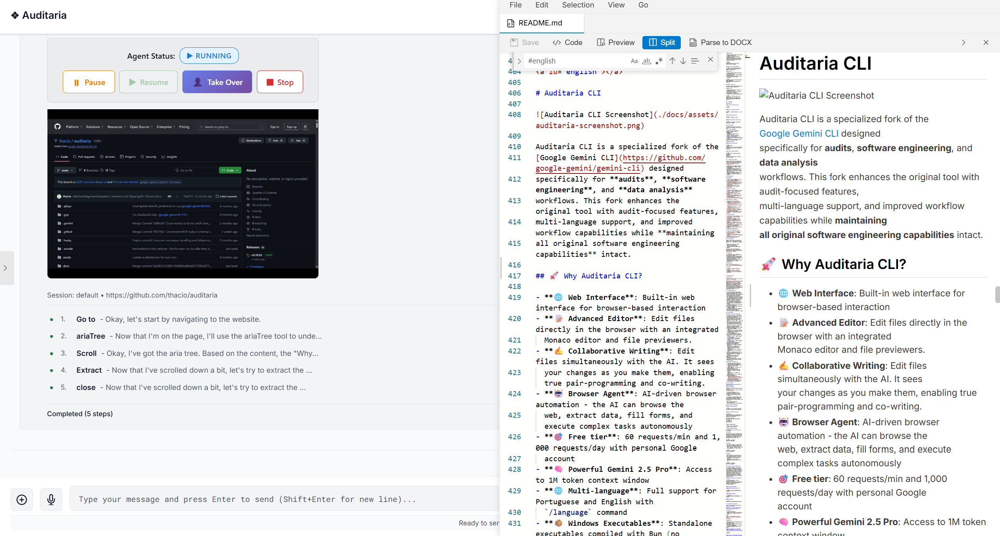

# Auditaria

[](https://github.com/thacio/auditaria/releases)
[](https://github.com/thacio/auditaria/blob/main/LICENSE)

- [Jump to English Instructions](#english)
- [Instruções em Português (BR)](#português)

---

<a id="português"></a>


O Auditaria é um fork especializado do
[Google Gemini CLI](https://github.com/google-gemini/gemini-cli) projetado
especificamente para fluxos de trabalho de **auditorias**, **engenharia de
software** e **análise de dados**. Este fork aprimora a ferramenta original com
recursos focados em auditoria, suporte multi-idioma e capacidades de fluxo de
trabalho melhoradas, mantendo **todas as capacidades originais de engenharia de
software** intactas.

## 🚀 Por que Auditaria?

- **🌐 Interface Web**: Interface web integrada para interação baseada em
  navegador
- **📝 Editor Avançado**: Edite arquivos diretamente no navegador com um editor
  Monaco integrado e visualizadores de arquivo.
- **✍️ Escrita Colaborativa**: Edite arquivos simultaneamente com a IA. Ela vê
  suas alterações em tempo real, permitindo uma verdadeira programação em par e
  co-escrita.
- **🤖 Agente de Navegação**: Automação de navegador com IA - a IA pode navegar
  na web, extrair dados, preencher formulários e executar tarefas complexas
  autonomamente
- **💬 Integrações de Mensagens**: Telegram, Discord e Microsoft Teams —
  converse com a IA direto nas suas plataformas de comunicação
- **🎯 Nível gratuito**: 60 solicitações/min e 1.000 solicitações/dia com conta
  pessoal do Google
- **🧠 Poderoso Gemini 2.5 Pro**: Acesso a janela de contexto de 1M tokens
- **🌐 Multi-idioma**: Suporte completo para Português e Inglês com comando
  `/language`
- **📦 Executáveis Windows**: Executáveis standalone compilados com Bun (sem
  necessidade de instalação de Node.js)
- **🛡️ Código aberto**: Licenciado sob Apache 2.0

## 📋 Principais Recursos

### Melhorias Exclusivas do Auditaria

- **🌐 Interface Web**: Uma interface web completa com um explorador de arquivos
  e abas para uma experiência de usuário aprimorada.
- **📝 Editor Avançado**: Um editor de código integrado (Monaco, o motor do VS
  Code) com visualizadores de arquivo integrados para PDFs, imagens, vídeos e
  muito mais.
- **✍️ Escrita Colaborativa**: Ativa um fluxo de trabalho verdadeiramente
  colaborativo onde você e a IA podem modificar o mesmo arquivo simultaneamente.
  A IA está sempre ciente de suas edições, permitindo um trabalho de equipe
  interativo em código e documentos.
- **🤖 Agente de Navegação (Browser Agent)**: Automação de navegador com IA
  usando Stagehand
  - Streaming ao vivo do navegador na interface web
  - Controle de execução (pausar/continuar/parar)
  - Modo takeover: assuma controle manual do navegador durante a execução
  - Capturas de telas
- **🔄 Provedores de LLM Alternativos**: Troque entre diferentes backends de IA
  em tempo de execução usando o menu `/model`. Todas as ferramentas do Auditaria
  funcionam independente do provedor — gerenciamento de contexto, escrita
  colaborativa, busca de conhecimento, agente de navegação e habilidades. Requer
  que as CLIs externas estejam instaladas e configuradas separadamente.
  - **[Claude Code](https://docs.anthropic.com/en/docs/claude-code)**: Use
    Claude (Opus, Sonnet, Haiku) como backend alternativo com o mesmo contexto,
    memória e ferramentas customizadas
  - **[OpenAI Codex](https://github.com/openai/codex)**: Use modelos ChatGPT
    Codex como backend alternativo com as mesmas ferramentas e gerenciamento de
    contexto
  - **[GitHub Copilot](https://docs.github.com/en/copilot/how-tos/copilot-cli/use-copilot-cli)**:
    Use modelos do Copilot (Claude, Gemini, GPT e mais) com sua assinatura do
    GitHub Copilot
- **🎯 Gerenciamento de Contexto**: Ferramentas integradas para inspecionar,
  esquecer e restaurar conteúdo da conversa para otimizar uso de tokens
  - `context_inspect` - Inspecionar histórico e estatísticas de tokens
  - `context_forget` - Esquecer conteúdo grande (amnésia completa até
    restauração)
  - `context_restore` - Restaurar conteúdo esquecido quando necessário
- **🎓 Habilidades de Agente (Agent Skills)**: Sistema modular de habilidades
  que estende as capacidades do Auditaria com conhecimento especializado em
  domínios específicos. Implementa o mesmo sistema de skills do Claude, sendo
  compatível com skills do Claude
  - Descoberta automática de habilidades em `.auditaria/skills/`
  - Compatível com skills criadas para Claude
  - Crie habilidades customizadas com arquivos SKILL.md
- **🌐 Suporte Multi-idioma**: Internacionalização completa com suporte para
  Português e Inglês (com comando `/language`)
- **🔍 Busca de Conhecimento**: O agente pode indexar e buscar em todos os
  documentos do projeto usando busca por palavra-chave (correspondência exata),
  semântica (entende significado) ou híbrida (combina ambas para melhores
  resultados). Suporta PDFs, Office, imagens com OCR e mais. Use
  `/knowledge-base init` para iniciar.
- **💬 Integrações com Plataformas de Mensagens**: Interaja com o Auditaria
  através de plataformas de mensagens populares, mantendo sincronização
  bidirecional com a CLI
  - **Telegram**: Bot com streaming em tempo real, suporte a imagens e controle
    de acesso por usuário (`/telegram start`)
  - **Discord**: Bot com streaming em tempo real, suporte a imagens e comandos
    integrados (`/discord start`)
  - **Microsoft Teams**: Integração via Power Automate com sessões isoladas por
    thread, modos de resposta plugáveis (sync/async/pull/hybrid) e tunelamento
    ngrok (`/teams start`)
- **🎯 Recursos Focados em Auditoria**: Prompts de sistema especializados e
  capacidades adaptadas para tarefas de auditoria
- **📊 Ferramentas de Análise de Dados**: Capacidades aprimoradas para analisar
  e trabalhar com dados de auditoria

### Recursos Herdados do Gemini CLI

- **Compreensão e Geração de Código**
  - Consultar e editar grandes bases de código
  - Gerar novos aplicativos a partir de PDFs, imagens ou esboços usando
    capacidades multimodais
  - Depurar problemas e solucionar com linguagem natural
- **Automação e Integração**
  - Automatizar tarefas operacionais como consultar pull requests ou lidar com
    rebases complexos
  - Usar servidores MCP para conectar novas capacidades
  - Executar de forma não interativa em scripts para automação de fluxo de
    trabalho
- **Capacidades Avançadas**
  - Fundamentar consultas com
    [Google Search](https://ai.google.dev/gemini-api/docs/grounding) integrado
  - Checkpointing de conversação para salvar e retomar sessões complexas
  - Arquivos de contexto personalizados (GEMINI.md) para adaptar o comportamento
    aos seus projetos

## 📦 Instalação

### Executáveis Windows Standalone (Sem Node.js)

#### Download Direto

Baixe os executáveis Windows pré-compilados da
[página de releases](https://github.com/thacio/auditaria/releases):

- **`auditaria-windows.exe`** - CLI executável standalone (~125MB)
- **`auditaria-launcher.exe`** - Launcher com interface gráfica para selecionar
  diretório de trabalho (~125MB)

**⚠️ Aviso de Segurança Corporativa**: Os executáveis são compilados usando Bun
e não são assinados digitalmente. Políticas corporativas de segurança podem
bloquear a execução. Você pode precisar:

- Adicionar uma exceção no antivírus
- Executar como administrador
- Usar a instalação via npm como alternativa

### Instalação Rápida com Node.js

#### Executar instantaneamente com npx

```bash
# Usando npx (sem instalação necessária)
npx @thacio/auditaria
```

#### Instalar globalmente com npm

```bash
# Via npm
npm install -g @thacio/auditaria

# Ou clonar e construir
git clone https://github.com/thacio/auditaria
cd ./auditaria
npm run build
npm run bundle
npm install -g .
```

#### Requisitos do Sistema

- Node.js versão 20 ou superior
- macOS, Linux ou Windows

### Configuração de Firewall Corporativo (MITM)

**⚠️ AVISO DE SEGURANÇA**: Desabilitar a verificação SSL pode representar uma
falha de segurança. No entanto, em ambientes corporativos com firewall MITM, o
npm recusará a instalação porque o firewall substitui os certificados SSL
originais por seus próprios certificados para inspecionar o tráfego. Isso faz
com que o npm detecte um certificado "não confiável" e bloqueie a instalação.
**Use estas configurações apenas em redes corporativas confiáveis onde a TI
controla a infraestrutura.**

#### Configuração do NPM para Instalação

```bash
# Instalar o Auditaria com verificação SSL desabilitada
npm install -g @thacio/auditaria --strict-ssl=false
```

#### Configuração de Execução

##### Windows Command Prompt (cmd)

```cmd
set NODE_TLS_REJECT_UNAUTHORIZED=0 && auditaria
```

##### Windows PowerShell

```powershell
$env:NODE_TLS_REJECT_UNAUTHORIZED = "0"; auditaria
```

##### Linux/macOS

```bash
NODE_TLS_REJECT_UNAUTHORIZED=0 auditaria
```

## 🔐 Opções de Autenticação

Escolha o método de autenticação que melhor atende às suas necessidades:

### Opção 1: Login OAuth (Usando sua Conta Google)

**✨ Melhor para:** Desenvolvedores individuais e qualquer pessoa com licença
Gemini Code Assist

**Benefícios:**

- **Nível gratuito**: 60 solicitações/min e 1.000 solicitações/dia
- **Gemini 2.5 Pro** com janela de contexto de 1M tokens
- **Sem gerenciamento de chave API** - apenas faça login com sua conta Google
- **Atualizações automáticas** para os modelos mais recentes

```bash
auditaria
# Escolha OAuth e siga o fluxo de autenticação do navegador
```

### Opção 2: Chave da API Gemini

**✨ Melhor para:** Desenvolvedores que precisam de controle específico do
modelo ou acesso pago

**Benefícios:**

- **Nível gratuito**: 100 solicitações/dia com Gemini 2.5 Pro
- **Seleção de modelo**: Escolha modelos Gemini específicos
- **Cobrança baseada em uso**: Atualize para limites mais altos quando
  necessário

```bash
# Obtenha sua chave em https://aistudio.google.com/apikey
export GEMINI_API_KEY="YOUR_API_KEY"
auditaria
```

### Opção 3: Vertex AI

**✨ Melhor para:** Equipes empresariais e cargas de trabalho de produção

**Benefícios:**

- **Recursos empresariais**: Segurança e conformidade avançadas
- **Escalável**: Limites de taxa mais altos com conta de cobrança
- **Integração**: Funciona com infraestrutura existente do Google Cloud

```bash
# Obtenha sua chave do Google Cloud Console
export GOOGLE_API_KEY="YOUR_API_KEY"
export GOOGLE_GENAI_USE_VERTEXAI=true
auditaria
```

## 🚀 Começando

### Uso Básico

#### Iniciar no diretório atual

```bash
auditaria
```

#### Incluir múltiplos diretórios

```bash
auditaria --include-directories ../lib,../docs
```

#### Usar modelo específico

```bash
auditaria -m gemini-2.5-flash
```

#### Modo não interativo para scripts

```bash
auditaria -p "Explique a arquitetura desta base de código"
```

### Interface Web

A interface web fornece uma maneira alternativa de interagir com o Auditaria
através do seu navegador:

- **Interface web habilitada por padrão**: `auditaria` (abre automaticamente o
  navegador)
- **Desabilitar interface web**: `auditaria --no-web`
- **Iniciar sem abrir navegador**: `auditaria --no-web-browser`
- **Comando durante execução**: Use `/web` para abrir a interface web a qualquer
  momento
- **Porta padrão**: 8629 (usa uma porta aleatória se estiver ocupada)

### Exemplos Rápidos

#### Iniciar um novo projeto

```bash
cd novo-projeto/
auditaria
> Escreva-me um bot Discord que responde perguntas usando um arquivo FAQ.md que fornecerei
```

#### Analisar código existente

```bash
git clone https://github.com/thacio/auditaria
cd auditaria
auditaria
> Me dê um resumo de todas as mudanças que entraram ontem
```

## 🔗 Integração com GitHub

Integre o Auditaria diretamente em seus fluxos de trabalho do GitHub com a
[**Gemini CLI GitHub Action**](https://github.com/google-github-actions/run-gemini-cli):

- **Revisões de Pull Request**: Revise automaticamente pull requests quando
  forem abertos
- **Triagem de Issues**: Trie e rotule automaticamente issues do GitHub
- **Colaboração sob demanda**: Mencione `@gemini-cli` em issues e pull requests
  para assistência
- **Fluxos de trabalho personalizados**: Configure suas próprias tarefas
  agendadas e automações orientadas por eventos

## 📚 Documentação

### Começando

- [**Guia de Início Rápido**](./docs/cli/index.md) - Comece rapidamente
- [**Configuração de Autenticação**](./docs/cli/authentication.md) -
  Configuração detalhada de autenticação
- [**Guia de Configuração**](./docs/cli/configuration.md) - Configurações e
  personalização
- [**Atalhos de Teclado**](./docs/keyboard-shortcuts.md) - Dicas de
  produtividade

### Recursos Principais

- [**Referência de Comandos**](./docs/cli/commands.md) - Todos os comandos slash
  (`/help`, `/chat`, `/mcp`, etc.)
- [**Checkpointing**](./docs/checkpointing.md) - Salvar e retomar conversas
- [**Gerenciamento de Memória**](./docs/tools/memory.md) - Usando arquivos de
  contexto GEMINI.md
- [**Cache de Tokens**](./docs/cli/token-caching.md) - Otimizar uso de tokens

### Ferramentas e Extensões

- [**Visão Geral das Ferramentas Integradas**](./docs/tools/index.md)
  - [Operações do Sistema de Arquivos](./docs/tools/file-system.md)
  - [Comandos Shell](./docs/tools/shell.md)
  - [Web Fetch e Pesquisa](./docs/tools/web-fetch.md)
  - [Operações Multi-arquivo](./docs/tools/multi-file.md)
- [**Integração com Servidor MCP**](./docs/tools/mcp-server.md) - Estenda com
  ferramentas personalizadas
- [**Extensões Personalizadas**](./docs/extension.md) - Construa seus próprios
  comandos

### Tópicos Avançados

- [**Visão Geral da Arquitetura**](./docs/architecture.md) - Como o Auditaria
  CLI funciona
- [**Integração com IDE**](./docs/extension.md) - Companheiro VS Code
- [**Sandboxing e Segurança**](./docs/sandbox.md) - Ambientes de execução
  seguros
- [**Implantação Empresarial**](./docs/deployment.md) - Docker, configuração em
  todo o sistema
- [**Telemetria e Monitoramento**](./docs/telemetry.md) - Rastreamento de uso
- [**Desenvolvimento de API de Ferramentas**](./docs/core/tools-api.md) - Criar
  ferramentas personalizadas

### Solução de Problemas e Suporte

- [**Guia de Solução de Problemas**](./docs/troubleshooting.md) - Problemas
  comuns e soluções
- [**FAQ**](./docs/troubleshooting.md#frequently-asked-questions) - Respostas
  rápidas
- Use o comando `/bug` para relatar problemas diretamente da CLI

## 🤝 Contribuindo

Damos as boas-vindas a contribuições! O Auditaria é totalmente open source
(Apache 2.0), e encorajamos a comunidade a:

- Relatar bugs e sugerir recursos
- Melhorar a documentação
- Enviar melhorias de código
- Compartilhar seus servidores MCP e extensões

Veja nosso [Guia de Contribuição](./CONTRIBUTING.md) para configuração de
desenvolvimento, padrões de codificação e como enviar pull requests.

## 📖 Recursos

- **[Roadmap Oficial](./ROADMAP.md)** - Veja o que vem a seguir
- **[Repositório GitHub](https://github.com/thacio/auditaria)** - Código fonte
- **[Issues do GitHub](https://github.com/thacio/auditaria/issues)** - Relate
  bugs ou solicite recursos
- **[Releases](https://github.com/thacio/auditaria/releases)** - Versões
  disponíveis

### Desinstalar

Veja o [Guia de Desinstalação](docs/Uninstall.md) para instruções de remoção.

## 📄 Legal

- **Licença**: [Apache License 2.0](LICENSE)
- **Termos de Serviço**: [Termos e Privacidade](./docs/tos-privacy.md)
- **Segurança**: [Política de Segurança](SECURITY.md)

---

<a id="english"></a>

# Auditaria


Auditaria is a specialized fork of the
[Google Gemini CLI](https://github.com/google-gemini/gemini-cli) designed
specifically for **audits**, **software engineering**, and **data analysis**
workflows. This fork enhances the original tool with audit-focused features,
multi-language support, and improved workflow capabilities while **maintaining
all original software engineering capabilities** intact.

## 🚀 Why Auditaria?

- **🌐 Web Interface**: Built-in web interface for browser-based interaction
- **📝 Advanced Editor**: Edit files directly in the browser with an integrated
  Monaco editor and file previewers.
- **✍️ Collaborative Writing**: Edit files simultaneously with the AI. It sees
  your changes as you make them, enabling true pair-programming and co-writing.
- **🤖 Browser Agent**: AI-driven browser automation - the AI can browse the
  web, extract data, fill forms, and execute complex tasks autonomously
- **💬 Messaging Integrations**: Telegram, Discord, and Microsoft Teams — chat
  with the AI directly from your communication platforms
- **🎯 Free tier**: 60 requests/min and 1,000 requests/day with personal Google
  account.
- **🧠 Powerful Gemini 3 models**: Access to improved reasoning and 1M token
  context window.
- **🌐 Multi-language**: Full support for Portuguese and English with
  `/language` command
- **📦 Windows Executables**: Standalone executables compiled with Bun (no
  Node.js installation required)
- **🛡️ Open source**: Apache 2.0 licensed.

## 📋 Key Features

### Auditaria Exclusive Enhancements

- **🌐 Web Interface**: A full-featured web UI with a file browser and tabs for
  an enhanced user experience.
- **📝 Advanced Editor**: An integrated code editor (Monaco, the engine that
  powers VS Code) with built-in file previewers for PDFs, images, videos, and
  more.
- **✍️ Collaborative Writing**: Enables a true collaborative workflow where you
  and the AI can modify the same file simultaneously. The AI is always aware of
  your edits, allowing for interactive teamwork on code and documents.
- **🤖 Browser Agent**: AI-driven browser automation using Stagehand
  - Live browser streaming in the web interface
  - Execution control (pause/resume/stop)
  - Takeover mode: take manual control of the browser during execution
  - Take Screenshots
- **🔄 Alternative LLM Providers**: Switch between different AI backends at
  runtime using the `/model` menu. All Auditaria tools work regardless of
  provider — context management, collaborative writing, knowledge search,
  browser agent, and skills. Requires the external CLIs to be installed and
  configured separately.
  - **[Claude Code](https://docs.anthropic.com/en/docs/claude-code)**: Use
    Claude (Opus, Sonnet, Haiku) as an alternative backend with the same
    context, memory, and custom tools
  - **[OpenAI Codex](https://github.com/openai/codex)**: Use ChatGPT Codex
    models as an alternative backend with the same tools and context management
  - **[GitHub Copilot](https://docs.github.com/en/copilot/how-tos/copilot-cli/use-copilot-cli)**:
    Use Copilot models (Claude, Gemini, GPT, and more) with your GitHub Copilot
    subscription
- **🎯 Context Management**: Built-in tools to inspect, forget, and restore
  conversation content to optimize token usage
  - `context_inspect` - Inspect history and token statistics
  - `context_forget` - Forget large content (complete amnesia until restored)
  - `context_restore` - Restore forgotten content when needed
- **🎓 Agent Skills**: Modular skills system that extends Auditaria's
  capabilities with specialized domain-specific knowledge. Implements the same
  skills system as Claude, making it compatible with Claude skills
  - Automatic skill discovery from `.auditaria/skills/`
  - Compatible with skills created for Claude Code
  - Create custom skills with SKILL.md files
- **🌐 Multi-language Support**: Full internationalization with Portuguese and
  English support (with `/language` command)
- **🔍 Knowledge Search**: The agent can index and search through all project
  documents using keyword (exact match), semantic (understands meaning), or
  hybrid search (combines both for best results). Supports PDFs, Office files,
  images with OCR, and more. Use `/knowledge-base init` to get started.
- **💬 Messaging Platform Integrations**: Interact with Auditaria through
  popular messaging platforms with bidirectional CLI sync
  - **Telegram**: Bot with real-time streaming, image support, and per-user
    access control (`/telegram start`)
  - **Discord**: Bot with real-time streaming, image support, and built-in
    commands (`/discord start`)
  - **Microsoft Teams**: Power Automate integration with per-thread isolated
    sessions, pluggable response modes (sync/async/pull/hybrid), and ngrok
    tunneling (`/teams start`)
- **🎯 Audit-Focused Features**: Specialized system prompts and capabilities
  tailored for audit tasks
- **📊 Data Analysis Tools**: Enhanced capabilities for analyzing and working
  with audit data

### Inherited from Gemini CLI

- **Code Understanding & Generation**
  - Query and edit large codebases
  - Generate new apps from PDFs, images, or sketches using multimodal
    capabilities
  - Debug issues and troubleshoot with natural language
- **Automation & Integration**
  - Automate operational tasks like querying pull requests or handling complex
    rebases
  - Use MCP servers to connect new capabilities
  - Run non-interactively in scripts for workflow automation
- **Advanced Capabilities**
  - Ground your queries with built-in
    [Google Search](https://ai.google.dev/gemini-api/docs/grounding)
  - Conversation checkpointing to save and resume complex sessions
  - Custom context files (GEMINI.md) to tailor behavior for your projects

## 📦 Installation

See
[Auditaria CLI installation, execution, and releases](./docs/get-started/installation.md)
for recommended system specifications and a detailed installation guide.

### Windows Standalone Executables (No Node.js Required)

#### Direct Download

Download pre-compiled Windows executables from the
[releases page](https://github.com/thacio/auditaria/releases):

- **`auditaria-windows.exe`** - Standalone CLI executable (~125MB)
- **`auditaria-launcher.exe`** - GUI launcher to select working directory
  (~125MB)

**⚠️ Corporate Security Warning**: The executables are compiled using Bun and
are not digitally signed. Corporate security policies may block execution. You
may need to:

- Add an antivirus exception
- Run as administrator
- Use npm installation as an alternative

### Quick Install with Node.js

#### Run instantly with npx

```bash
# Using npx (no installation required)
npx @thacio/auditaria
```

#### Install globally with npm

```bash
# Via npm
npm install -g @thacio/auditaria

# Or clone and build
git clone https://github.com/thacio/auditaria
cd ./auditaria
npm run build
npm run bundle
npm install -g .
```

#### System Requirements

- Node.js version 20 or higher
- macOS, Linux, or Windows

#### Install globally with MacPorts (macOS)

```bash
sudo port install gemini-cli
```

#### Install with Anaconda (for restricted environments)

```bash
# Create and activate a new environment
conda create -y -n gemini_env -c conda-forge nodejs
conda activate gemini_env

# Install Gemini CLI globally via npm (inside the environment)
npm install -g @google/gemini-cli
```

## Release Cadence and Tags

See [Releases](./docs/releases.md) for more details.

### Preview

New preview releases will be published each week at UTC 23:59 on Tuesdays. These
releases will not have been fully vetted and may contain regressions or other
outstanding issues. Please help us test and install with `preview` tag.

```bash
npm install -g @thacio/auditaria@preview
```

### Stable

- New stable releases will be published each week at UTC 20:00 on Tuesdays, this
  will be the full promotion of last week's `preview` release + any bug fixes
  and validations. Use `latest` tag.

```bash
npm install -g @thacio/auditaria@latest
```

### Nightly

- New releases will be published each day at UTC 00:00. This will be all changes
  from the main branch as represented at time of release. It should be assumed
  there are pending validations and issues. Use `nightly` tag.

```bash
npm install -g @thacio/auditaria@nightly
```

### Corporate Firewall (MITM) Setup

**⚠️ SECURITY WARNING**: Disabling SSL verification may represent a security
flaw. However, in corporate environments with MITM firewalls, npm will refuse to
install because the firewall replaces the original SSL certificates with its own
certificates to inspect traffic. This causes npm to detect an "untrusted"
certificate and block the installation. **Use these settings only in trusted
corporate networks where IT controls the infrastructure.**

#### NPM Configuration for Installation

```bash
# Install Auditaria with SSL verification disabled
npm install -g @thacio/auditaria --strict-ssl=false
```

#### Runtime Configuration

##### Windows Command Prompt (cmd)

```cmd
set NODE_TLS_REJECT_UNAUTHORIZED=0 && auditaria
```

##### Windows PowerShell

```powershell
$env:NODE_TLS_REJECT_UNAUTHORIZED = "0"; auditaria
```

##### Linux/macOS

```bash
NODE_TLS_REJECT_UNAUTHORIZED=0 auditaria
```

## 🔐 Authentication Options

Choose the authentication method that best fits your needs:

### Option 1: Login with Google (OAuth login using your Google Account)

**✨ Best for:**

- Individual developers.
- Google AI Pro and AI Ultra subscribers.
- Anyone who has a Gemini Code Assist license.

_See
[quota limits and terms of service](https://cloud.google.com/gemini/docs/quotas)
for details._

**Benefits:**

- **Free tier**: 60 requests/min and 1,000 requests/day
- **Gemini 3 models** with 1M token context window
- **No API key management** - just sign in with your Google account
- **Automatic updates** to our latest models

#### Start Auditaria, then choose _Login with Google_ and follow the browser authentication flow when prompted

```bash
auditaria
```

#### If you are using a paid Code Assist License from your organization, remember to set the Google Cloud Project

```bash
# Set your Google Cloud Project
export GOOGLE_CLOUD_PROJECT="YOUR_PROJECT_ID"
auditaria
```

### Option 2: Gemini API Key

**✨ Best for:** Developers who need specific model control or paid tier access

**Benefits:**

- **Free tier**: 1000 requests/day with Gemini 3 (mix of flash and pro)
- **Model selection**: Choose specific Gemini models
- **Usage-based billing**: Upgrade for higher limits when needed

```bash
# Get your key from https://aistudio.google.com/apikey
export GEMINI_API_KEY="YOUR_API_KEY"
auditaria
```

### Option 3: Vertex AI

**✨ Best for:** Enterprise teams and production workloads

**Benefits:**

- **Enterprise features**: Advanced security and compliance
- **Scalable**: Higher rate limits with billing account
- **Integration**: Works with existing Google Cloud infrastructure

```bash
# Get your key from Google Cloud Console
export GOOGLE_API_KEY="YOUR_API_KEY"
export GOOGLE_GENAI_USE_VERTEXAI=true
auditaria
```

## 🚀 Getting Started

### Basic Usage

#### Start in current directory

```bash
auditaria
```

#### Include multiple directories

```bash
auditaria --include-directories ../lib,../docs
```

#### Use specific model

```bash
auditaria -m gemini-2.5-flash
```

#### Non-interactive mode for scripts

Get a simple text response:

```bash
auditaria -p "Explain the architecture of this codebase"
```

For more advanced scripting, including how to parse JSON and handle errors, use
the `--output-format json` flag to get structured output:

```bash
auditaria -p "Explain the architecture of this codebase" --output-format json
```

For real-time event streaming (useful for monitoring long-running operations),
use `--output-format stream-json` to get newline-delimited JSON events:

```bash
auditaria -p "Run tests and deploy" --output-format stream-json
```

### Web Interface

The web interface provides an alternative way to interact with Auditaria through
your browser:

- **Web interface enabled by default**: `auditaria` (automatically opens
  browser)
- **Disable web interface**: `auditaria --no-web`
- **Start without opening browser**: `auditaria --no-web-browser`
- **Command during runtime**: Use `/web` to open the web interface at any time
- **Default port**: 8629 (uses a random port if occupied)

### Quick Examples

#### Start a new project

```bash
cd new-project/
auditaria
> Write me a Discord bot that answers questions using a FAQ.md file I will provide
```

#### Analyze existing code

```bash
git clone https://github.com/thacio/auditaria
cd auditaria
auditaria
> Give me a summary of all of the changes that went in yesterday
```

## 📚 Documentation

### Getting Started

- [**Quickstart Guide**](./docs/get-started/index.md) - Get up and running
  quickly.
- [**Authentication Setup**](./docs/get-started/authentication.md) - Detailed
  auth configuration.
- [**Configuration Guide**](./docs/reference/configuration.md) - Settings and
  customization.
- [**Keyboard Shortcuts**](./docs/reference/keyboard-shortcuts.md) -
  Productivity tips.

### Core Features

- [**Commands Reference**](./docs/reference/commands.md) - All slash commands
  (`/help`, `/chat`, etc).
- [**Custom Commands**](./docs/cli/custom-commands.md) - Create your own
  reusable commands.
- [**Context Files (GEMINI.md)**](./docs/cli/gemini-md.md) - Provide persistent
  context to Auditaria CLI.
- [**Checkpointing**](./docs/cli/checkpointing.md) - Save and resume
  conversations.
- [**Token Caching**](./docs/cli/token-caching.md) - Optimize token usage.

### Tools & Extensions

- [**Built-in Tools Overview**](./docs/reference/tools.md)
  - [File System Operations](./docs/tools/file-system.md)
  - [Shell Commands](./docs/tools/shell.md)
  - [Web Fetch & Search](./docs/tools/web-fetch.md)
  - [Multi-file Operations](./docs/tools/multi-file.md)
- [**MCP Server Integration**](./docs/tools/mcp-server.md) - Extend with custom
  tools
- [**Custom Extensions**](./docs/extension.md) - Build your own commands

### Advanced Topics

- [**Headless Mode (Scripting)**](./docs/cli/headless.md) - Use Auditaria in
  automated workflows.
- [**Architecture Overview**](./docs/architecture.md) - How Auditaria works.
- [**IDE Integration**](./docs/ide-integration/index.md) - VS Code companion.
- [**Sandboxing & Security**](./docs/cli/sandbox.md) - Safe execution
  environments.
- [**Trusted Folders**](./docs/cli/trusted-folders.md) - Control execution
  policies by folder.
- [**Enterprise Guide**](./docs/cli/enterprise.md) - Deploy and manage in a
  corporate environment.
- [**Telemetry & Monitoring**](./docs/cli/telemetry.md) - Usage tracking.
- [**Tools reference**](./docs/reference/tools.md) - Built-in tools overview.
- [**Local development**](./docs/local-development.md) - Local development
  tooling.

### Troubleshooting & Support

- [**Troubleshooting Guide**](./docs/resources/troubleshooting.md) - Common
  issues and solutions.
- [**FAQ**](./docs/resources/faq.md) - Frequently asked questions.
- Use `/bug` command to report issues directly from the CLI.

### Using MCP Servers

Configure MCP servers in `~/.gemini/settings.json` to extend Auditaria with
custom tools:

```text
> @github List my open pull requests
> @slack Send a summary of today's commits to #dev channel
> @database Run a query to find inactive users
```

See the [MCP Server Integration guide](./docs/tools/mcp-server.md) for setup
instructions.

## 🤝 Contributing

We welcome contributions! Auditaria is fully open source (Apache 2.0), and we
encourage the community to:

- Report bugs and suggest features
- Improve documentation
- Submit code improvements
- Share your MCP servers and extensions

See our [Contributing Guide](./CONTRIBUTING.md) for development setup, coding
standards, and how to submit pull requests.

## 📖 Resources

- **[Official Roadmap](./ROADMAP.md)** - See what's coming next.
- **[Changelog](./docs/changelogs/index.md)** - See recent notable updates.
- **[NPM Package](https://www.npmjs.com/package/@thacio/auditaria)** - Package
  registry.
- **[GitHub Repository](https://github.com/thacio/auditaria)** - Source code.
- **[GitHub Issues](https://github.com/thacio/auditaria/issues)** - Report bugs
  or request features.
- **[Security Advisories](https://github.com/thacio/auditaria/security/advisories)** -
  Security updates.
- **[Releases](https://github.com/thacio/auditaria/releases)** - Available
  versions.

### Uninstall

See the [Uninstall Guide](./docs/resources/uninstall.md) for removal
instructions.

## 📄 Legal

- **License**: [Apache License 2.0](LICENSE)
- **Terms of Service**: [Terms & Privacy](./docs/resources/tos-privacy.md)
- **Security**: [Security Policy](SECURITY.md)

---
